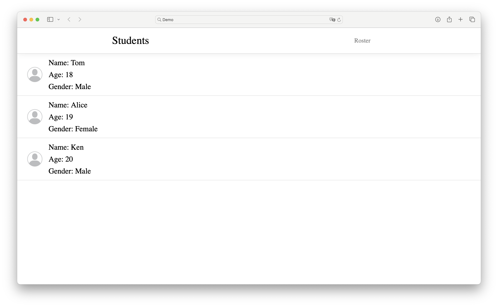

<div align='center'>
  <h1>PythonWebUI</h1>
  <p>Rapid HTML Construction with Python</p>
  <br/>
  <a href='./cn_zh.md'>简体中文</a>
</div>


## Installation


### Via Pip

> [!IMPORTANT]
>
> PythonWebUI is currently in Beta and does not yet support Pip installation. Please manually add this package to your project.


## Quick Start


### Rapid Construction with HTMLBulider

```Python
from PythonWebUI import *
from PythonWebUI.HTMLNodes import *
from PythonWebUI.HTMLBulider import *

page=Page(
          HTMLSet([
            NavigationBar("Demo",[A("1",href="#1"),A("2",href="#2"),A("1",href="#3")]),
            VStack(HTMLSet([
                 VStack(HTMLSet([
                     Span("Hello World!")
                         .text_align('left'),
                 ]))
            ]))
          ])
)
```


### HTML-Only Construction

```Python
from PythonWebUI import *
from PythonWebUI.HTMLNodes import *

page=Html(HTMLSet([
        Head(HTMLSet([
        	Meta(charset='utf-8'),
          Link(href="./css.css",rel="stylesheet"),
        ])),
        Body(HTMLSet([
            Div(String("1234").wrapped(Sup())),
            H1("Hello"),
            Thead(HTMLSet([
                String("1234"),
                String("1234"),
            ]))
                .style("color:red;")

       ]))
]))
```


### Save as HTML

```Python
with open('./demo.html','w') as html:
    html.write(str(page))
```


### Integration with Django

```Python
from django.http import HttpResponse
from PythonWebUI import *
from PythonWebUI.HTMLNodes import *
from PythonWebUI.HTMLBulider import *

page=Page(
          HTMLSet([
#            ...
          ])
)

def demoPage(request):
    return HttpResponse(page)
```


## Examples

### Student Roster



```Python
from PythonWebUI import *
from PythonWebUI.HTMLNodes import *
from PythonWebUI.HTMLBulider import *

class Person:
    def __init__(self,name,age,gender,photo='./image.jpg'):
        self.name=name
        self.age=age
        self.gender=gender
        self.photo=photo

students=[Person("Tom",18,'Male'),Person("Alice",19,'Female'),Person("Ken",20,'Male')]

page=Page(HTMLSet([
    NavigationBar("Students",[A("All Student",href="#").color('gray').text_decoration('none')]),
    VStack(HTMLSet([
        ForEach(students,lambda student: HTMLSet([
            HStack(HTMLSet([
                Img(student.photo)
                    .width('60px')
                    .border_radius('500px'),
                VStack(HTMLSet([
                    Span(f"Name: {student.name}"),
                    Span(f"Age: {student.age}"),
                    Span(f"Gender: {student.gender}")
                ]))      
            ]))
                .width('100%')
                .text_align('left')
                .border_bottom('rgb(218, 218, 218) 1px solid')
                .font_size('25px')
                .padding_left('50px'),
        ]))
    ])), 
]),head=HTMLSet([
    Title("Students")
]))
```
